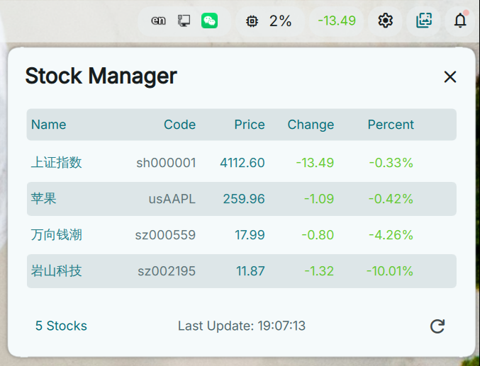

# DankMaterialShell StockManager Plugin

A real-time A-share stock quote monitoring plugin for DankMaterialShell.

<!-- README.md (英文) 顶部 -->
🇨🇳 **English** | [中文](./README.zh-CN.md)

## Features

- 📊 **Live Quotes** – Automatically refreshes stock data every 30 seconds
- 📈 **Gain/Loss Display** – Red for gain, green for loss, clear at a glance
- 🔍 **Multi-Stock Monitoring** – Monitor multiple stocks simultaneously
- 📱 **DankBar Integration** – Shows Shanghai Composite Index change in the status bar

## Screenshot

## Keyboard Shortcuts

- `F` – Search / Add Stock
- `E` – Toggle Edit Mode
- `R` – Refresh Data
- `Delete` / `Backspace` – Remove Stock
- `Enter` – Pin / Unpin Stock
- `j` / `k` (or `↑` / `↓`) – Navigate List
- `Shift` + `j` / `k` (or `Shift` + `↑` / `↓`) – Move Stock Position
- `1` - `5` – Sort by Name / Code / Price / Change / Percent

## Data Source

Real-time A-share market data is fetched from the Tencent Finance API.

## Displayed Fields

- **Name** – Stock name
- **Last** – Latest price
- **Change** – Price change (points)
- **Change %** – Percentage change

## API Field Mapping

Tencent stock API response data mapping:

- `parts[3]` – Current price
- `parts[4]` – Previous close price
- `parts[31]` – Price change
- `parts[32]` – Change percentage

## Dependencies

- **curl** – Fetch stock data
- **iconv** – Convert GBK to UTF-8

## Author

leemeng0x61@gmail.com

## Changelog

### v1.2.1 (2026-02-06)

- ✅ **Stock Detail Popup**: Click on any stock to view detailed information.

### v1.2.0 (2026-02-01)

- ✅ **Trend Charts**: Added sparklines to visualize price history in the list view.
- ✅ **Advanced Customization**: Support for custom trend colors (Up/Down), status bar scrolling, and configurable refresh intervals.
- ✅ **Display Modes**: Toggle between Percent/Amount and various Name formats (Pinyin/Hanzi).
- ✅ **Improved Interaction**: Swipe gestures to Pin/Delete stocks.
- ✅ **Keyboard Shortcuts**: Comprehensive keyboard control for navigation, sorting, and editing.
- ✅ **Enhanced Add Dialog**: Search by stock code, name, or pinyin.

### v1.1.0 (2026-01-30)

- ✅ Code refactoring with modular architecture
- ✅ Separated data management and UI components
- ✅ Unified utility function library
- ✅ Performance optimizations, reduced unnecessary re-renders
- ✅ Improved code maintainability

### v1.0.0 (2026-01-14)

- ✅ Real-time quote display
- ✅ Gain/loss color highlighting
- ✅ DankBar integration to show Shanghai Composite Index
- ✅ Auto refresh mechanism
- ✅ JSON-based configuration support

## License

MIT License - See LICENSE file for details
