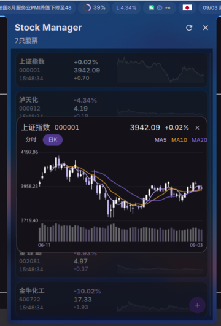

# DankMaterialShell StockManager 插件

用于 DankMaterialShell 的行情监控插件，支持 A 股、ETF、指数和行业板块。

<!-- README.zh-CN.md (中文) 顶部 -->
🇺🇸 [English](./README.md) | **中文**

## 功能特性

- 📊 **实时行情** - 按可配置间隔自动刷新行情
- 📈 **分时与日 K** - 支持一分钟分时图、近 60 日 K 线以及 MA5/MA10/MA20
- 🔍 **分类搜索** - 支持搜索和筛选 A 股、ETF、指数与行业板块
- 📌 **列表管理** - 支持新增、删除、调整顺序和一键置顶
- 📱 **DankBar 集成** - 任意已添加证券均可固定到状态栏，包括上证指数
- 🎨 **显示设置** - 支持自定义涨跌颜色、状态栏格式、滚动方式和列表走势图

## 屏幕截图

## 快捷键支持

- `R` - 刷新数据
- `Delete` / `Backspace` - 删除选中股票
- `Enter` - 固定 / 取消固定到状态栏
- `j` / `k`（或 `↑` / `↓`）- 上下选择
- `Shift` + `j` / `k` (或 `Shift` + `↑` / `↓`) - 调整股票位置
- `gg` / `Shift` + `g` - 跳到第一项 / 最后一项
- `1`–`5` - 按名称 / 代码 / 价格 / 涨跌额 / 涨跌幅排序

## 数据来源

- 腾讯财经：实时行情、搜索候选和日 K 数据
- 新浪财经：一分钟分时数据
- 东方财富：行业板块搜索、实时行情、分时及日 K 数据

外部数据源可能偶发不可用。板块请求采用有限重试；日 K 页面会区分“暂无数据”和“加载失败”，失败时可点击重试。

## 显示字段

- **名字** - 股票名称
- **最新** - 最新价格
- **涨跌** - 涨跌额（点数）
- **涨幅** - 涨跌幅度（百分比）

## 数据字段说明

腾讯股票API返回数据格式：

- `parts[3]` - 当前价
- `parts[4]` - 昨收价
- `parts[31]` - 涨跌额
- `parts[32]` - 涨幅%

## 依赖

- curl - 用于获取股票数据
- iconv - 用于GBK转UTF-8

## 作者

leemeng0x61@gmail.com

## 更新日志

### 未发布

- 新增 A 股、ETF、指数和行业板块分类搜索，并加入搜索防抖。
- 新增一分钟分时图和可切换的近 60 日日 K 图。
- 日 K 图新增 MA5、MA10 和 MA20 均线。
- 图表涨跌范围支持自动升档，并区分加载失败与无数据状态。
- 新增列表一键置顶，任意已添加证券均可固定到状态栏。
- 更新整体界面并清理废弃的设置内部项。

### v1.2.1 (2026-02-06)

- ✅ **股票详情弹窗**: 点击股票可查看详细信息。

### v1.2.0 (2026-02-01)

- ✅ **价格走势图**: 列表视图新增迷你走势图 (Sparklines)，直观展示近期趋势。
- ✅ **个性化设置**: 支持自定义涨跌颜色、状态栏滚动显示、以及配置刷新频率。
- ✅ **显示模式**: 可切换百分比/金额显示，以及拼音/汉字等多种名称显示格式。
- ✅ **交互优化**: 新增左滑删除、右滑置顶手势。
- ✅ **快捷键支持**: 支持键盘全功能操作（排序、移动、编辑）。
- ✅ **搜索增强**: 添加股票弹窗支持按代码、名称或拼音搜索。

### v1.1.0 (2026-01-30)

- ✅ 代码重构，模块化设计
- ✅ 分离数据管理与UI组件
- ✅ 统一工具函数库
- ✅ 性能优化，减少不必要的重渲染
- ✅ 代码可维护性提升

### v1.0.0 (2026-01-14)

- ✅ 实时行情显示
- ✅ 涨跌颜色标识
- ✅ DankBar集成显示上证指数
- ✅ 自动刷新机制
- ✅ JSON配置支持

## 许可证

MIT 许可证 - 详见 LICENSE 文件
